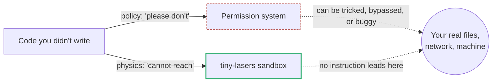
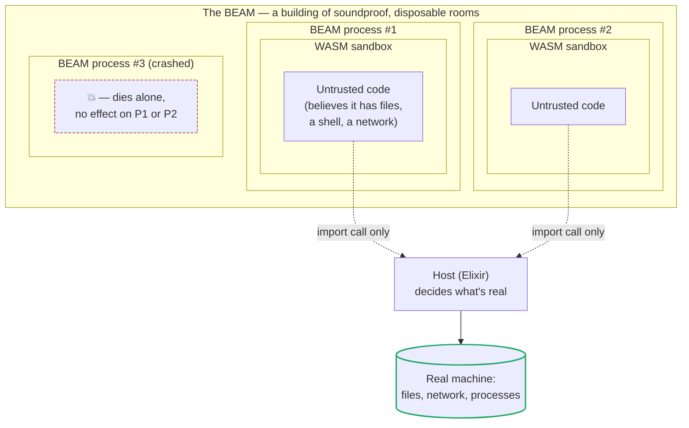
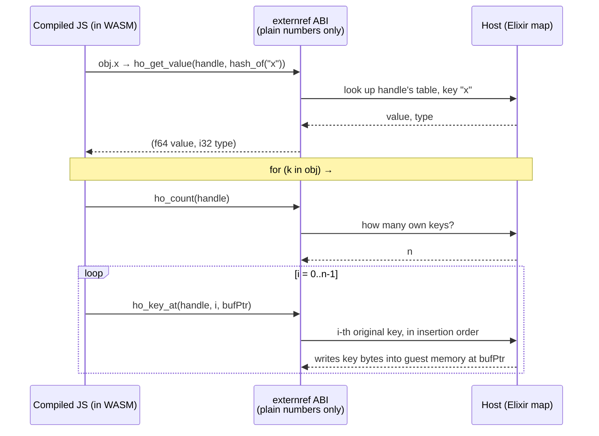
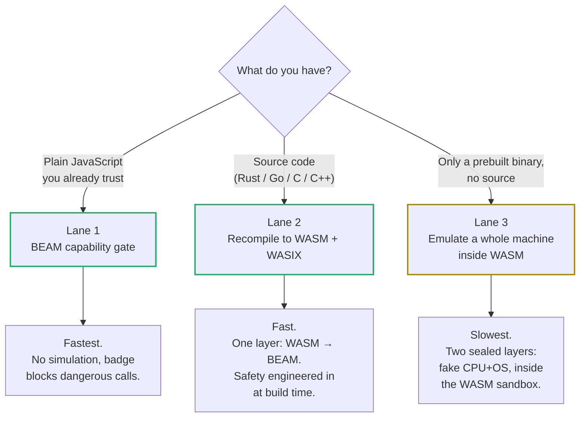
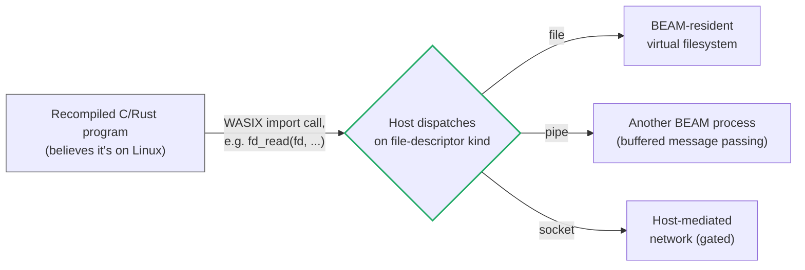
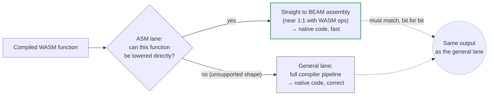

# tiny-lasers

Run code you don't trust, without trusting it.

That's the whole idea. Download a script, an npm package, someone's plugin — you don't know what it does. tiny-lasers gives that code a sealed box to run in. Inside the box, it can do anything it wants. Outside the box, nothing happens. Your files, your network, your machine — untouched, no matter what the code tries.

It works for more than JavaScript. Rust, Go, C, C++ — anything that compiles to WebAssembly can run here, contained the same way.

This document explains the problem, the two pieces of technology the solution is built from, the specific design decisions that make it fast instead of just safe, and the proof that it actually works. It's long on purpose — the goal isn't a quick pitch, it's that you finish reading and actually understand how this works, not just that it works.

---

## Part 1 — The problem

### Why "just don't run bad code" doesn't work

Every program that processes other people's code has this problem, whether or not it admits it. A build tool that runs a config file. A platform that lets users upload scripts. An editor with a plugin system. A CI pipeline that runs someone's `npm install`. In every one of those cases, you're choosing to execute instructions you didn't write, based on trust you can't fully verify.

The usual answer is "we'll review the code first." That doesn't scale, and it doesn't catch everything — code can behave one way during review and another way when it actually runs, and a sufficiently popular ecosystem (think npm, with millions of packages) makes manual review of everything physically impossible. At some point, you're running code you haven't fully inspected, written by someone you've never met, and hoping for the best.

"Hoping for the best" is not a security model. The alternative is to not need trust at all — to build a wall around the code so that even if it's actively malicious, it simply cannot reach anything that matters. That's containment, and it's a much older idea than computers: a quarantine room, a bank's safety deposit box accessible only through a teller, a prison visitation room with glass between you and the visitor. The room lets interaction happen while making certain outcomes structurally impossible, not just policy-forbidden.

### What "structurally impossible" buys you that policy doesn't

A permission system says "this code is not allowed to read your files." A sandbox says "this code has no instruction that can reach your files, because the files aren't there." The first is a rule that a clever or buggy program might find a way around. The second isn't a rule at all — it's a fact about what's physically reachable from inside the box. There's no door to pick the lock on, because the door doesn't lead anywhere real.

This is the difference tiny-lasers is built around. Everything below — WebAssembly, the BEAM, the lane architecture — exists to make "structurally impossible" cheap enough to use everywhere, instead of expensive enough to reserve for special cases.

---

## Part 2 — The two technologies this is built on

Real isolation has historically meant real cost: a virtual machine that boots its own kernel, a container that namespaces an entire Linux process tree, a whole second computer running in software just to keep one program contained. tiny-lasers avoids that weight by combining two pieces of technology that were each independently built to solve a piece of this problem, neither originally with the other in mind.

### WebAssembly (WASM): a computer with no exits

WebAssembly is a format for compiled code — similar in spirit to the machine code your processor runs directly, but designed from day one to be **embedded** inside another program instead of run loose on real hardware. Browsers were the original use case: a way to run compiled C++ or Rust inside a web page without giving that code free rein over your computer.

The property that matters for tiny-lasers isn't speed (though WASM is fast — close to native machine code). It's the **shape** of what a WASM program is allowed to do:

- **It runs in a private memory space.** A WASM module gets a fixed, contiguous block of memory — called *linear memory* — and it can only read and write inside that block. It cannot address memory outside it. There's no pointer arithmetic that escapes, because there's no address space beyond the block to escape into.
- **It can only call functions it was explicitly given.** A WASM module declares the host functions it wants to import by name, and the program running it (the *host*) decides what those names actually do — or refuses to provide them at all. A module can't call `delete_file()` unless the host specifically wired up a function with that name. If the host never offers it, the capability doesn't exist from the module's point of view.
- **It's validated before it runs.** Every WASM module is checked for structural correctness — types match, stack effects balance, jumps land somewhere valid — before a single instruction executes. Malformed or deliberately adversarial bytecode is rejected at the door, not caught mid-execution.

Put plainly: a WASM module is a closed room with one door, and the host holds the only key, decides who's allowed through, and chooses exactly what's on the other side. The simplest way to think about it is a flight simulator — every instrument responds, every reading looks real, the pilot can do anything the cockpit allows — but there's no actual aircraft underneath, and nothing the pilot does inside it touches the real sky.

### The BEAM: a building made of soundproof rooms

The BEAM is the virtual machine that runs Erlang and Elixir programs. It was built originally for telephone switches — equipment that has to keep routing calls even while individual components are failing, because a phone network going down is not an acceptable outcome. That requirement shaped the whole design.

The BEAM's core idea is the **process**: an extremely lightweight, fully isolated unit of execution. Not an operating-system process (those are comparatively heavy — megabytes of memory, milliseconds to start) but a BEAM-native one, cheap enough that a single machine routinely runs millions of them at once. Each BEAM process has:

- **Its own private memory**, never shared with another process by default. Two processes can't accidentally (or maliciously) read or corrupt each other's state, because there's no shared memory for that to happen in.
- **No shared mutable state with the rest of the system.** Communication happens by explicitly sending messages, not by reaching into someone else's memory.
- **Independent failure.** If a BEAM process crashes, it dies alone. Nothing else running on the same machine is affected. The system's philosophy is literally called "let it crash" — failures are expected, isolated, and recovered from, rather than prevented by exhaustive defensive coding everywhere.

That's a building made of soundproof rooms with no shared walls: a fire in one room doesn't even produce smoke in the next one, because there's no shared air duct for it to travel through.

### Why these two fit together

WASM gives you a closed room with one door. The BEAM gives you a building designed to run an enormous number of closed rooms at once, cheaply, with total isolation between them and graceful handling when one of them goes wrong. tiny-lasers runs a WASM sandbox **inside** a BEAM process: every piece of untrusted code gets its own disposable, walled-off unit, sealed by WASM's structural guarantees and hosted by a runtime that was built from the ground up to never let one unit's failure become anyone else's problem.

Inside that combined box, the untrusted code believes it has a filesystem, a shell, a network connection — ordinary things any real program expects. None of that is real. The host (tiny-lasers) writes the entire script for that performance, decides exactly what's true and what isn't, and the guest code has no way to tell the difference from the inside.

Each guest gets its own room (a WASM sandbox) inside its own soundproof building unit (a BEAM process). The only way out of the room is the one door the host built — the import call — and the host decides what's behind it.

---

## Part 3 — How the host and the sandbox actually talk to each other (the ABI)

Sealing the code off from the real machine is only half the job. Code still needs to *do things* — print output, read a fake file, look up a property on an object — and those things have to actually happen somewhere. That's what an **ABI** is for.

ABI stands for **Application Binary Interface**. Where an API is the human-readable contract between two pieces of source code ("call this function with these arguments"), an ABI is the equivalent contract at the level of raw bytes and memory layout — exactly which bits go where, in what order, so that two pieces of *compiled* code (which no longer have function names or types, just numbers) can still understand each other. Whenever WASM code calls out to the host, or the host hands data back in, both sides have to agree on the ABI, or the bytes get misread and the whole thing breaks silently.

### The basic call-out ABI

The first and simplest ABI in tiny-lasers is the **import call**: the WASM module declares a function it wants to call by name (say, `print`), and the host provides the real implementation. When the guest "prints," it isn't writing to a real terminal — it's calling a host function that captures the bytes into a buffer tiny-lasers controls. The guest experiences this as completely normal `console.log`-style output. The host experiences it as a function call it fully owns, with full discretion over what to do with the result.

### The harder problem: JavaScript objects don't fit in WASM natively

WebAssembly's native value types are numbers — integers and floats. JavaScript objects, with named properties, dynamic shape, and prototype chains, don't have a natural representation in raw WASM numbers. The compiler (more on where it comes from below) represents every JavaScript value as a small pair: a number plus a type tag, so the compiled code always knows whether it's holding an integer, a string, or something else.

For plain objects, tiny-lasers extends this with what we call the **externref ABI** (an externref, short for "external reference," is WASM terminology for a value that points to something the host manages rather than something WASM itself stores). Instead of laying an object's properties out in WASM's own linear memory, an object becomes a tagged **handle** — an opaque number with a flag bit set — that points to a real entry in a table the host keeps on the Elixir side. Property access on that object isn't a memory read inside the WASM sandbox at all; it's a host import call, the same mechanism described above, that looks the property up in a native Elixir map.

This buys two things at once: it's a real performance win (a direct host-side map lookup beats walking a chain of branches checking value types one at a time — measured about 3.2x faster on a hot property-access loop), and it cleanly answers a question that would otherwise be awkward — when JavaScript code asks "what are this object's keys" or loops with `for...in`, the host already has the answer sitting in a table, in the original insertion order, ready to hand back.

The contract for this ABI is a small, explicit set of host functions — created, set a value, get a value, check if a key exists, delete a key, count the keys, fetch the *n*th key — each taking and returning plain numbers, because that's all an ABI boundary can carry. Every one of those functions has to agree, byte for byte, with what the compiled WASM code expects, or property access silently returns garbage instead of failing loudly. Getting an ABI right is exacting, unglamorous work, and it's also exactly the kind of work that, once done, becomes invisible — which is why it's worth explaining here instead of leaving it as a black box.

Every arrow above crosses the sandbox boundary as plain numbers — no object pointers, no shared memory, no shortcuts. That's the ABI doing its job: real interaction, zero structural trust required.

---

## Part 4 — The lane architecture: three ways in, picked by how much you trust the code

Not all untrusted code is equally risky, and not all of it needs the same amount of ceremony to run safely. tiny-lasers offers three lanes, and you pick the one that matches what you actually know about the code you're running.

### Lane 1 — JavaScript, badge and go

If the code is plain JavaScript, it doesn't get a WASM sandbox at all — it gets a badge. tiny-lasers runs it natively on the BEAM, but first attaches a **capability gate**: a mechanical check that blocks the code from ever reaching certain dangerous internal operations, no matter how it tries to phrase the request. There's no simulation overhead, because there's no simulation — the code runs directly, fast, and the badge simply makes specific doors impossible to open. This lane is for code you already trust enough to keep close, where the real risk is accidental overreach rather than deliberate attack.

### Lane 2 — Bring your own source, we'll rebuild it to fit

For Rust, Go, C, or C++ where you have the actual source code, tiny-lasers recompiles it to target the WASM sandbox directly, with a fuller POSIX-like compatibility layer underneath so the program's normal expectations (a filesystem, basic system calls) are satisfied by fakes instead of breaking outright. Because the rebuild is engineered to fit the box from the very first compile, the result runs close to native speed once it's through. You pay the cost once, upfront, at build time — not every time the code runs.

#### What "a fuller POSIX-like layer" actually means: WASIX

Ordinary programs don't just compute — they open files, spawn threads, read the clock, talk to sockets. Those aren't things a program does on its own; they're requests it makes to the operating system, through a fixed, well-known set of operations called **syscalls** (system calls) — `open`, `read`, `write`, `socket`, `clone`, and so on. That fixed set of operations, and the rules for how a program asks for them, is what **POSIX** standardizes: it's the common contract that lets Linux, macOS, and countless tools all understand "open a file" the same way.

Plain WebAssembly doesn't have any of this built in — by design, since the whole point of WASM is that a module can't reach the real machine. The bridge that lets recompiled C, Rust, Go, and C++ programs still believe they're talking to a normal POSIX system is called **WASIX**: a standardized set of WASM import functions that stand in for real syscalls. A WASIX-targeted program calls `open` the same way it always would — it just doesn't know that "open" now lands on a host import instead of the real kernel.

That distinction matters because it answers a question that comes up immediately: if the code thinks it's making a normal syscall, where does that syscall actually go? In tiny-lasers, it's routed to whatever BEAM-native resource fits the request, not to a real OS:

A file read becomes a lookup against a virtual filesystem that lives entirely inside the BEAM, never touching a real disk. A pipe between two "processes" becomes ordinary buffered message passing between two real BEAM processes — there's no `fork`, no real process tree, just two lightweight BEAM units exchanging bytes the way the guest expects a pipe to behave. A socket call is routed through the host, which decides whether network access is allowed at all, and to what. Linear memory, the guest's only real piece of state, holds nothing but the transient buffer for whatever syscall is in flight — the actual resource always lives on the BEAM side, where it's cheap, isolated, and fully under the host's control.

This lane has been proven against real, demanding programs, not toy test cases: fourteen unmodified C and Rust programs — using sockets and polling, threads, terminal I/O, a TCP server, the `tokio` async runtime, real cryptography and compression libraries, even a thread-pool data-parallelism library (`rayon`) — were recompiled to this WASIX target and run correctly inside the sandbox. That's the proof that "fuller POSIX-like layer" isn't a hand-wave; it's specific, tested coverage of the syscalls real-world systems software actually needs.

It's also why Lane 3 isn't the default for compiled languages. An earlier design considered using a full x86 + Linux emulator (compiled itself to WASM) as the general-purpose answer for *any* native binary. Once WASIX proved it could carry real threaded, networked, crypto-using Rust and C programs, that heavyweight emulation path was dropped for anything with source available — it only earns its keep in Lane 3, for binaries nobody can recompile. Recompile-to-WASIX is a clean, direct seam straight onto the BEAM; emulating an entire computer is reserved for when there's truly no other option.

### Lane 3 — No source, no problem, just slower

Sometimes all you have is a finished binary, with no source code available — a closed tool, an old release, something you genuinely cannot recompile because you can't see inside it. For that case, tiny-lasers builds an entire fake computer: a simulated processor and a simulated operating system, running as WASM themselves, and the untrusted binary runs *inside that simulated machine* rather than inside the host directly. The binary is now wrapped in two sealed layers instead of one — it has no idea it isn't running on real hardware, and even if it tries something hostile, it can only act on the fake machine surrounding it. This is the slowest lane, because you're paying the cost of simulating an entire computer, but it's the only one that asks for nothing but the binary itself.

### One rule across all three

Untrusted code never touches the real processor — not once, not partially, not as a fallback. Lane 1 stays fast by constraining code that's already running close to home. Lane 2 stays fast by doing the safety engineering once, at build time, instead of on every run. Lane 3 buys total safety for total unknowns by paying for total simulation. The lane you pick should be a direct answer to one question: how much do you actually know about this code?

---

## Part 5 — Making the sandbox fast (the ASM lane)

A sandbox that works but runs slowly isn't really an alternative to native execution — it's a tax most people won't pay. So a meaningful part of the engineering here is making the WASM-to-BEAM path fast, not just correct.

The straightforward way to run WASM on the BEAM is to translate it into ordinary Elixir-level code and let the standard compiler pipeline handle the rest. That works, but it pays for several layers of general-purpose compiler machinery that WASM bytecode doesn't actually need, because WASM already arrives pre-optimized and close to the machine.

tiny-lasers also has a second path — internally called the **ASM lane** — that skips straight past that general pipeline. It lowers WASM instructions directly into BEAM's own internal assembly form (the literal opcode-level instructions the BEAM's JIT compiles to native machine code), function by function, almost one WASM instruction to one BEAM instruction. Skipping the general compiler frontend isn't just a shortcut — it avoids compiler passes whose cost grows faster than linearly with code size, so the ASM lane stays fast even as the amount of compiled guest code grows.

This isn't a separate, riskier implementation living alongside a "real" one — every function that goes through the ASM lane has to produce results that are bit-for-bit identical to the slower, more general lane. If a piece of code's behavior is too complex for the fast path to handle yet, it simply falls back to the general lane automatically. Speed is allowed to vary; correctness isn't allowed to.

The result of this work, measured rather than estimated: a real-world JavaScript parser running through the full pipeline went from 84 seconds to 23.9 seconds — a 3.5x speedup — through this kind of engine-level tuning, including faster handling of 64-bit decimal numbers (the `f64` type), which turned out to be one of the hottest paths in real compiled JavaScript.

---

## Part 6 — Where the JavaScript compiler came from, and what we did to it

The JavaScript side of tiny-lasers started from [Porffor](https://porffor.dev), an open-source project that compiles JavaScript straight to WebAssembly ahead of time, instead of interpreting it line by line at runtime — the same fundamental idea as compiling C to machine code, applied to JavaScript. We pulled its source directly into this codebase, and from that point on it stopped being an external dependency we wait on someone else to patch, and became code we work on directly, the same as anything else in this repository.

What that's meant in practice, concretely:

- We went in and fixed real, blocking bugs in how it compiles — including a bug in how it builds the bound environment for closures, which was preventing real bundlers like rollup from compiling at all, and a separate bug in how it generates the bytecode for branch tables (the mechanism that picks between multiple cases efficiently).
- We built a feature the original project never had: the externref ABI described above — the ability for compiled JavaScript to read, write, delete, and loop over plain objects, at near-native speed, by routing property access through a host-managed table instead of the compiler's original in-sandbox memory layout. That's new object-model engineering built on top of the compiler's existing design, not a configuration flag we flipped on.
- Seventeen separate, individually tested changes to the compiler's internals so far, each one verified against real compiled output before it shipped — not just "it compiled," but "it produces the exact output real JavaScript would produce."

Everything outside the compiler itself is ours from the ground up: the engine that actually executes the compiled WebAssembly on the BEAM (including the ASM lane described above), the host-call bridge that lets sandboxed code safely call back out to Elixir, and the conformance test harness that catches the moment compiled output stops matching what real JavaScript would do.

So: the compiler's lineage starts at Porffor — credit where it's due, the original idea and the initial codebase are theirs. But the compiler running in this repository today does not behave the way Porffor alone does, because we've rewritten parts of its internals and added a capability it shipped without. We took someone else's starting point and built our own compiler from it.

---

## Part 7 — The proof, not just the claim

Anyone can claim a sandbox is safe. Here's what's actually been checked, automatically, and is re-checked every time the code changes:

- **Security holds under deliberate attack.** Eighteen out of eighteen separate, deliberate attempts to break out of the sandbox were caught and blocked. The guest code has no working path into the parts of the system that matter, and that's tested directly, not assumed.
- **Real JavaScript runs exactly like real JavaScript.** Closures, regular expressions, big numbers, `Map` and `Set`, template strings, error handling, typed arrays, sorting — all run through the sandbox and produce output that's byte-for-byte identical to the same code run by Node.js itself. Not "close enough" — identical, checked automatically against the real thing.
- **A working shell runs entirely inside the sandbox.** Commands, pipes, output redirection, loops — a real command-line environment, faked from top to bottom, with nothing underneath it touching a real shell.
- **Other languages work too, completely unmodified.** Fourteen real C and Rust programs — including ones that use threads, asynchronous networking, file I/O, and real cryptography libraries — were recompiled through Lane 2 and run inside the sandbox without changing a single line of their original source, and they produced correct results. This is the strongest evidence the whole approach generalizes: it isn't a JavaScript-specific trick, it's a genuinely general way to safely run real software.
- **It's measurably getting faster.** The ASM-lane tuning described above took a real-world JavaScript parser from 84 seconds to 23.9 seconds, and the team measured exactly where the remaining time goes, rather than guessing — confirming the bottleneck is now in the compiled code's structure, not the engine running it.
- **Two hundred-plus automated tests, one known and pre-existing skip.** That one skip was already failing before this engine was pulled out into its own project, which is exactly how we know the move itself broke nothing — we checked, rather than assumed.

---

## What this is for

tiny-lasers exists for one situation: you need to run code, and you can't fully vouch for it. A plugin system. A build tool processing someone else's package. A platform letting users submit their own scripts. Anywhere "run this, but don't trust it" used to force a choice between a slow virtual machine, a sandbox with known leaks, or simply hoping for the best — tiny-lasers is built to be the alternative: real, structural isolation, without the weight of running a second computer underneath it.
